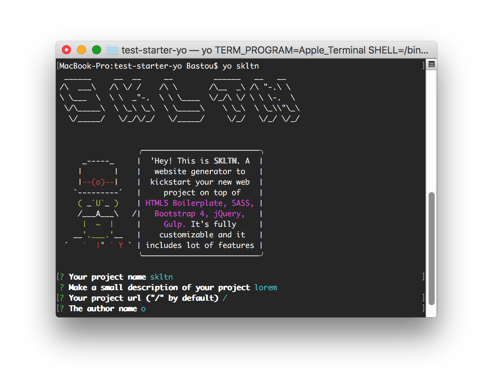
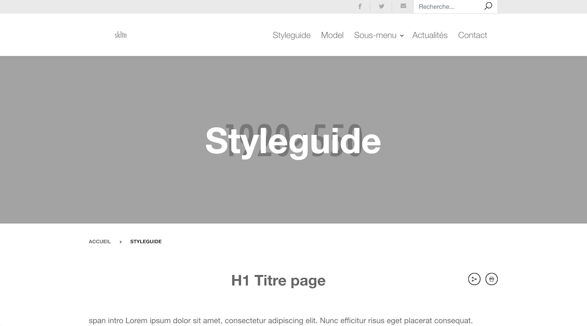
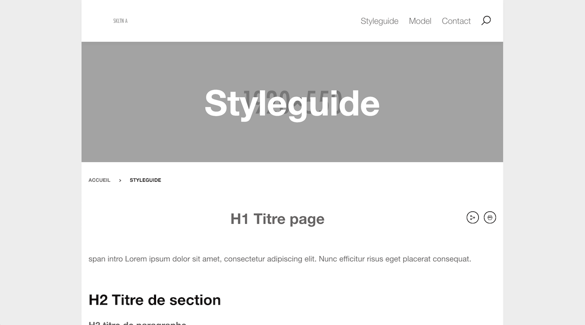
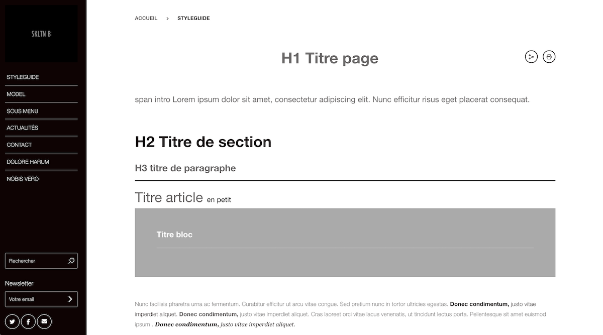

`skltn` skeleton website generator 
=======================

> Yeoman generator to kickstart your new web project on top of HTML5 Boilerplate, SASS, Bootstrap 4, jQuery, Gulp. Fully customizable, flexible, lot of features.

## Getting Started:
- Run `npm install --global yo gulp-cli` to install global packages
- Run `npm install` to install local packages
- Run `npm link` to add the generator to yeoman
- Run `yo skltn` to scaffold your webapp
- Run `gulp sass:watch` to compile css

## Features

- Latest version of [Bootstrap 4](https://v4-alpha.getbootstrap.com/)
- [Bourbon](http://bourbon.io/) : A lightweight library for sass
- Helper classes
- SASS compiler, watcher and autoprefixer with [gulp](http://gulpjs.com/)
- Javascript Linter with gulp
- Image optimizer with gulp

## Components
> Components are developed to be fully flexible and easily customizable

- Cards
- Forms
- Interactive maps
- Accordions 
- Tabs 
- Galleries with lightbox
- Filters
- Progress bar

## Models

- Contact
- Articles
- Rich content page

## Docs 

You can check the doc [here](docs/README.md)

## Samples

--------

--------

